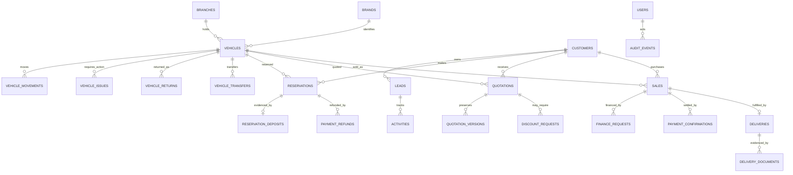

# Database Design

## Schema 1.13.0 increment (plugin 1.19.0)

Quote and quote-version rows add fee, promotion, subtotal and seller-identity snapshot columns. Discount requests add a frozen approval tier and signed before/after margin values. Reservations add the serialized deposit policy snapshot, required amount and refund state; `adc_reservation_deposits` holds independently reviewed evidence. Payment refunds can reference a cancelled reservation directly. `adc_delivery_documents` stores one audited reference per delivery/document type. These changes are additive; historical quote subtotals are derived only from already stored components, while historical seller identity is left empty rather than invented.

## Version 1.18.0 behavior (schema remains 1.12.0)

No new table or column is required. Explicit marketing preference is retained in WordPress user metadata before the first enquiry and synchronized transactionally to the existing customer consent columns when a canonical account-linked customer exists. Legacy CRM retirement uses private post metadata and does not rewrite Core customer/lead IDs. See `CUSTOMER-PREFERENCES.md`.

## Schema 1.12.0 increment

Adds nullable `customers.account_user_id` (unique) and `merged_into_id` (indexed), both unsigned bigint. Existing records remain NULL; no inferred account linkage, backfill or merge is performed by installation. Authenticated theme intake serializes against the WordPress user row (InnoDB required) and the customer row. Guest/REST contact matching does not establish ownership.

Reviewed CRM-only consolidation moves eligible lead references, clears source contact fields and keeps a tombstone pointing to the surviving customer. It does not rewrite reservation, quotation, quote-version or sale references. Customer authorization locks the active row and rejects merged source IDs before new operational references. Schema 1.12.0 was the target for that increment. See `CUSTOMER-IDENTITY.md`.

## Schema 1.11.0 increment

Adds nullable `adc_leads.public_request_key` and `public_payload_hash` (`char(64)`) and a unique index on `public_request_key`. Both values are HMACs using the WordPress authentication salt; raw replay UUIDs and contact payloads are not stored in these columns. Existing rows retain NULL values. The request key includes the authentication user ID; the payload includes normalized contact, request context and compatibility destination. Erasure/retention clears the payload hash while keeping the opaque key to reject replay of erased content.

Theme intake writes its message/booking compatibility row in the same transaction as the customer, lead, initial activity and audit. Existing theme tables must use InnoDB or intake returns 503. This increment does not convert engines, drop tables or backfill existing contacts. Schema installation is additive and runs through the existing guarded installer on WordPress bootstrap; upgrade/replay concurrency verification remains pending for 1.15.0.

## Schema 1.10.0 increment

Adds public vehicle fields `exterior_color`, `interior_color`, `engine_size`, `drivetrain`, nullable `doors`, `seats`, `horsepower`, and nullable plain-text `warranty`, `interior_features`, `exterior_features`, `safety_features`. No automatic source metadata backfill is performed. The existing schema inspector verifies these additive columns before guarded operations resume.

`vehicle_issues.inspection_baseline_id` captures the highest inspection ID when a case is resolved. A newly resolved case requires a later passed inspection before availability. Historical resolved cases have baseline zero; their past physical inspection chronology cannot be reconstructed by this column.

## Relationship overview

## Operational tables (target)

All IDs are unsigned bigint primary keys; all tables use the WordPress prefix. Add `created_at`, `updated_at` and suitable actor IDs where applicable. Use UTC timestamps. Monetary values are integer minor units (halalas) with currency code; do not use floating point.

| Table | Purpose and important constraints |
|---|---|
| `adc_branches` | Branch code unique; name, city, address, timezone, active flag. |
| `adc_brands` | Implemented in schema 1.4.0. Unique brand key, Arabic/English display names and active flag. |
| `adc_locations` | Implemented in schema 1.4.0. Unique code, parent branch, showroom/warehouse/yard/service type and active flag. |
| `adc_vehicles` | Vehicle identity, VIN unique, stock number unique, brand/branch IDs, specifications, condition, cost and public pricing, VAT attributes, status. Private cost fields have separately authorized reads. |
| `adc_vehicle_movements` | Immutable from/to branch/location/status, reason, actor and timestamp; index vehicle/time. |
| `adc_vehicle_receipts` | One physical receiving record per vehicle with location, staff, odometer, condition, document reference, notes and validated image evidence IDs. |
| `adc_vehicle_inspections` | Append-only mandatory checklist results, inspector, notes and validated image evidence IDs. Latest result gates availability. |
| `adc_vehicle_issues` | Open/resolved hold and maintenance cases with optional source inspection, reason, assignee, review date, resolution and responsible staff. One open case per vehicle is enforced by the service transaction. |
| `adc_vehicle_returns` | One controlled return per completed sale/delivery with branch/location, condition, odometer, document reference, reason, inspection baseline, responsible manager and pending-refund state. |
| `adc_vehicle_transfers` | Staged source/destination request with separate requester, approver, dispatcher and receiver IDs; branch/status queues are indexed. |
| `adc_customers` | Minimal contact/profile and consent timestamps; normalized mobile/email lookup indexes; retention and erasure policy required. |
| `adc_leads` | Customer, source, owner, branch, stage, lost reason, nullable legacy request reference and timestamps; indexes for branch/stage/owner/follow-up; unique nullable source-reference pair makes theme intake idempotent. |
| `adc_activities` | Lead/customer, kind, actor, notes, next action and due date; indexed by parent and due time. |
| `adc_reservations` | Vehicle/customer/branch/owner, expiry, frozen deposit policy/required amount, verified deposit/reference, refund state, status and idempotency key. Active reservation per vehicle is enforced by the locked vehicle transition. |
| `adc_reservation_deposits` | One current evidence record per reservation with exact required amount, unique source/reference, pending/verified/rejected state and separate recorder/reviewer. |
| `adc_quotations` | Current quote revision with integer amounts, frozen VAT basis points, customer, vehicle, validity and approval state. |
| `adc_quotation_versions` | Implemented in 1.2.0 and extended in 1.3.0. Append-only financial snapshots plus originating branch, customer display name and minimal vehicle identity, unique by quotation/version. No phone, email or VIN snapshot. Legacy upgrade captures only the current known revision and leaves an unknown historical VAT rate as `NULL`. |
| `adc_discount_requests` | Requested amount, frozen approval tier, signed margin impact, requester, approver, decision and reason; requester cannot approve own request. Legacy margins remain nullable when purchase cost was unavailable. |
| `adc_sales` | Reservation/quotation references, approved totals, invoice reference, owner and workflow state. |
| `adc_finance_requests` | Sale/customer/provider references, requested amount, consent and status; no bank credentials or card data. |
| `adc_payment_confirmations` | Implemented in 1.1.0. Sale, integer SAR amount, source/reference, pending/verified/rejected status, recorder/reviewer, decision reason and timestamps. Unique source/reference and indexed sale/status. No card/account credentials. |
| `adc_payment_refunds` | Return, sale cancellation or cancelled reservation, integer SAR amount, external method/reference, pending/verified/rejected status, requester/reviewer, decision reason and timestamps. Original receipts remain unchanged. |
| `adc_sale_cancellations` | One cancellation per undelivered sale with prior state, linked reservation/delivery/vehicle/branch, verified receipt snapshot, refund obligation, reason and manager. |
| `adc_deliveries` | Sale/vehicle, checklist, VIN confirmation, approvals and delivered timestamp. |
| `adc_delivery_documents` | One external evidence reference per delivery/document type with confirming user and UTC timestamp; configured requirements gate approval and release. |
| `adc_audit_events` | Implemented in 0.1.0. Append-only event key, actor, subject, reason, before/after JSON, correlation ID and UTC timestamp. |
| `adc_outbox` | Durable at-least-once event delivery with hashed idempotency/payload integrity, status, attempts, due time, worker lease, completion/failure timestamps and a safe error code. Payloads are minimized references. |
| `adc_integration_receipts` | Provider acknowledgement ledger linked one-to-one with outbox delivery when known; stores adapter/event, necessary opaque remote reference, SHA-256 fingerprint, safe status/error and UTC matching timestamps. |

Operational tables intentionally do not mirror post meta one-for-one. Foreign-key constraints are not assumed because WordPress installations may differ in engine/upgrade management; enforce relationships in repositories and index every join key. Unique VIN and stock number constraints are required. Never silently truncate/merge duplicate data during migration.

## Current state

Schema version is independent of the plugin version and currently `Schema::VERSION = 1.15.0`. Installation uses a per-database/prefix advisory lock, applies canonical DDL through dbDelta, then checks every declared table, column type/nullability/auto-increment, explicit default, full index column order/uniqueness and InnoDB engine. Only a verified schema and successful quote-history backfill receive the version marker. Failures store safe issue codes in `adc_schema_issues`, remove the success marker, show an administrator notice and delay automatic retry for five minutes. The installer does not silently convert existing MyISAM tables or remove/merge duplicate rows; those need reviewed repair. dbDelta may not repair numeric-default drift, which remains a reported failure until explicitly corrected.

Version 1.3.0 adds originating branch to current quotes and minimal documentary identity to revision rows. Older rows are enriched from the currently known related records and remain marked by their existing legacy event; the migration cannot reconstruct identity or branch at the historic issue time. Fresh installation, repeated installation, schema detection/repair, immutable quote revisions and additive upgrade behavior were exercised on an isolated MariaDB database. A production-copy migration/restore rehearsal remains outstanding.

The existing site stores vehicles/offers/CRM records in posts and post meta, and creates `car_dealer_bookings` / `car_dealer_messages` custom tables in theme code. Plugin tables are installed locally. New theme message/booking events are copied into `adc_customers`, `adc_leads` and `adc_activities` with source IDs; historical CRM and vehicle import commands are available through WP-CLI but have not been run against production data. Migrations must be versioned, idempotent, and tested against a copy of the production database before bulk data movement.
