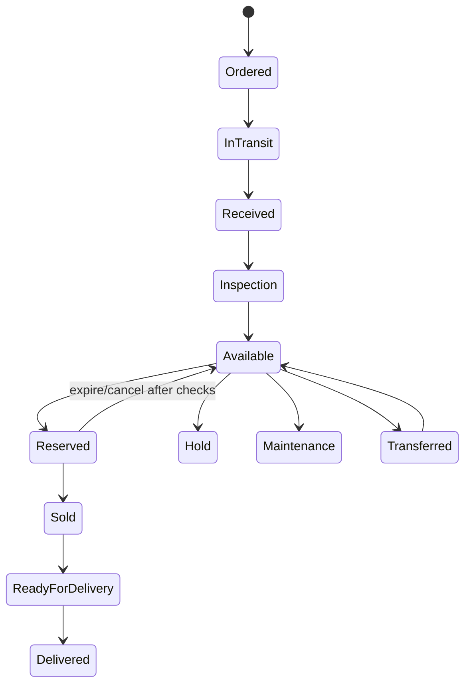

# Domain Workflows

Transitions below are target states; the current theme uses a smaller set and does not yet enforce these state machines consistently.

Lead: New → Contacted → Qualified → Quotation → Finance or Negotiation → Reserved → Won; any eligible stage may become Lost with required reason. Reservation: Confirmed → Converted to Sale, or Expired/Cancelled. Expiry releases only unpaid/unreferenced reservations; cancelled reservations with a deposit/reference put the vehicle on Hold for manual reconciliation. Sale: Quotation → Negotiation → discount review when policy requires it → reservation → payment/finance verification → sales approval → invoice reference → delivery preparation → delivery approval → vehicle release → delivered. Finance: Submitted → Under Review → Approved/Rejected; approval never implies payment. Delivery: Preparing → VIN confirmed → approved by another user → released by an authorized user → delivered. Any exceptional reversal records prior and new state, actor, UTC timestamp and reason.

Each transition is an application service operation that checks authorization and preconditions server side. Reservation confirmation must lock or atomically conditionally update the vehicle/reservation and recheck availability inside the transaction. Expiry jobs are idempotent and must not release a vehicle with payment verification, manager hold or active sale. No front-end supplied price, VIN confirmation or approval status is trusted.

## Implemented settlement gate in 1.1.0

External receipt recorded (pending) → independent financial reviewer → verified or rejected. The reviewer must differ from the recorder and sale owner. Receipt approvals lock the sale and cannot exceed its outstanding amount. Source/reference is unique. Only verified receipts count toward settlement; financing approval and deposit fields do not count.

Approved sale + invoice reference + full verified settlement → delivery preparation → confirmed VIN → separate delivery approval → release with settlement/sale/VIN/scope checks repeated → delivered. The sale owner and VIN confirmer cannot perform release. Tested receipt and delivery changes roll back together with inventory movement if required audit writes fail. Receipt refund/reversal and delivery document checklist remain pending.
